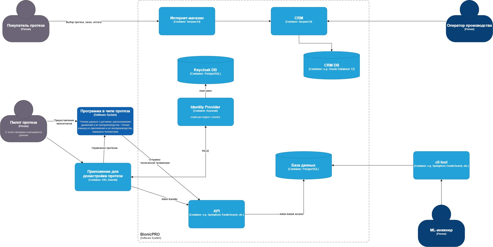
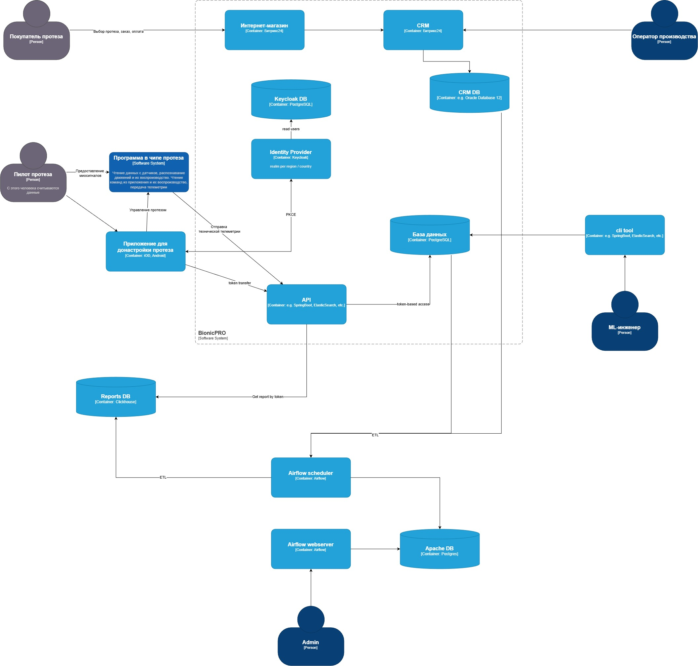

# Задание 1
1.1 Диаграмма и XML в папке "C4", файлы BionicPRO_C4_model_v2

1.2 Код PKCE flow реализован в рамках контейнеров с фронт-энд, keycloak; для запуска docker-compose up. Запуск всех контейнеров идет около 2х минут с учетом инициализации.

# Задание 2
2.1 Диаграмма и XML в папке "C4", файлы BionicPRO_C4_model_v3

2.2 Airflow в папке airflow, поднимается контейнерами в общем docker-compose. После инициализации через интерфейс (http://localhost:8081/home) залогиниться (логин пароль admin) запустить вручную DAG 	etl_crm_telemetry. Он запускается и по расписанию, но можно запустить вручную, чтобы не ждать.

2.3 Выгрузка отчета
Эндпойнт на вход не принимает доп.параметров идентификатора пользователя. На основе токена анализируется юзер и возвращается отчет именно по нему. Для тестирования - зайти на localhost:3000, залогиниться под одним из пользователей из realm и затем сгенерировать отчет. Отчет можно посмотреть в Dev Console в вкладке Response.